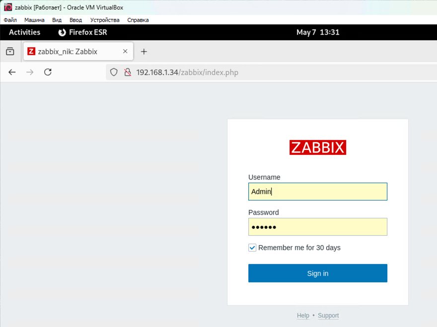
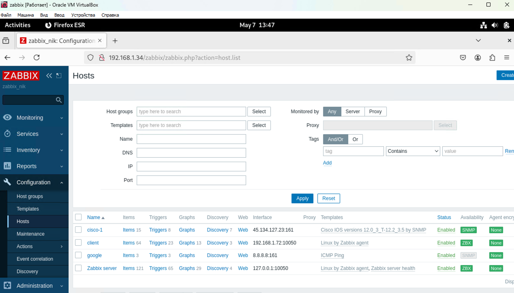
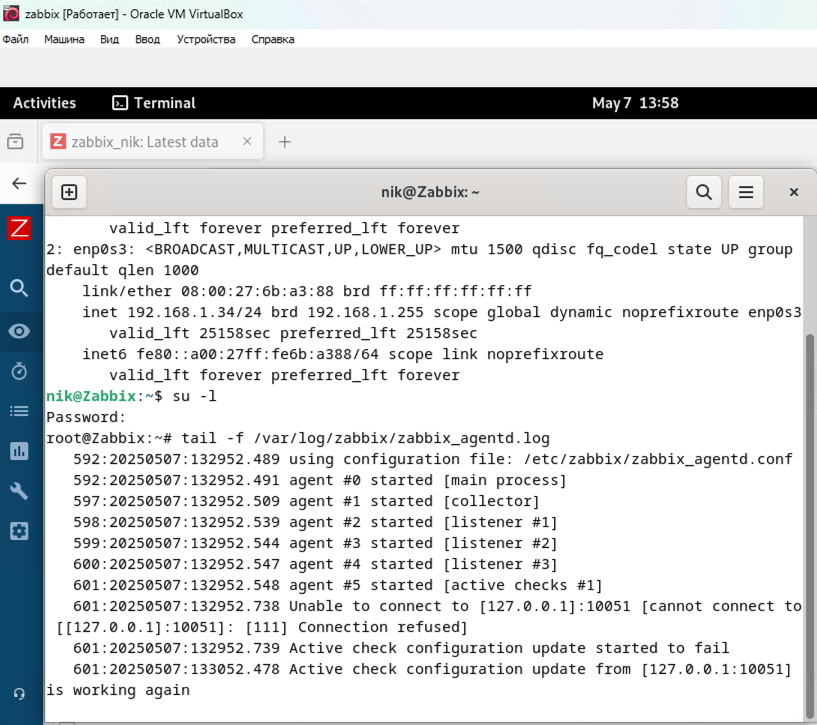
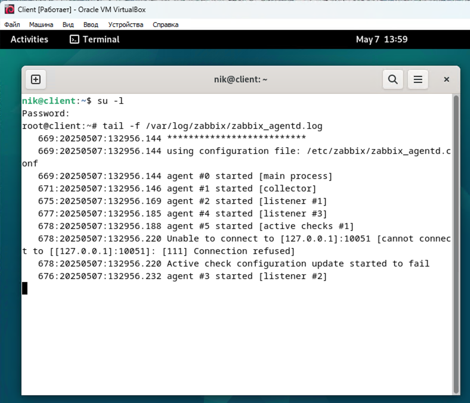
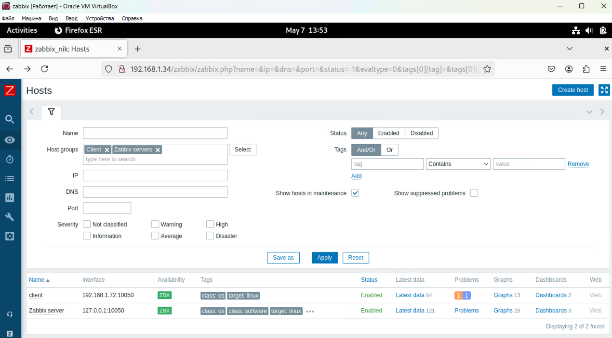
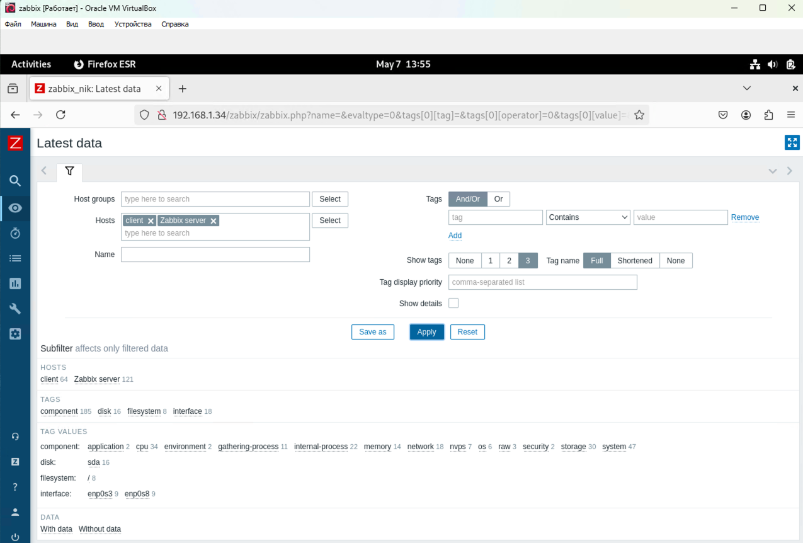
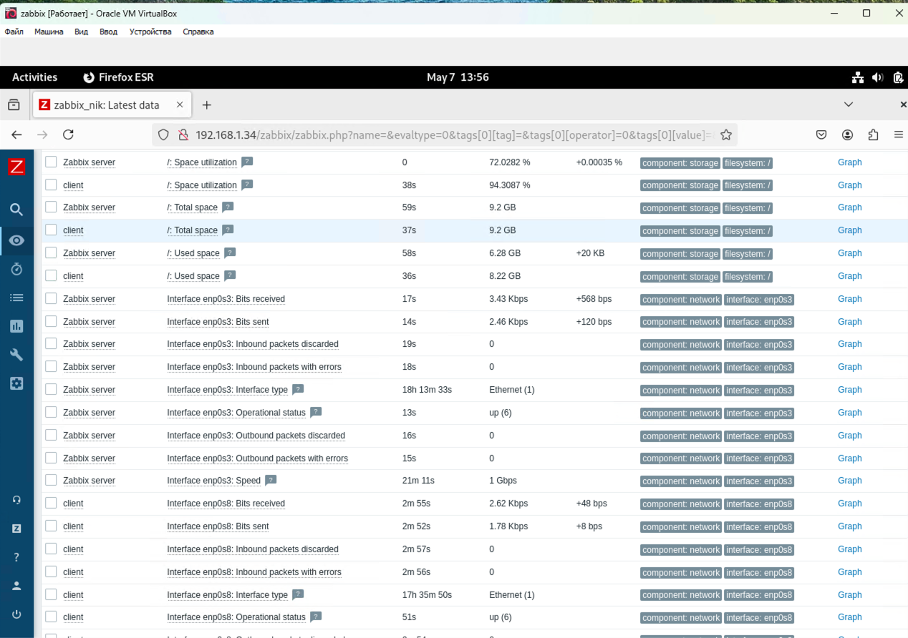
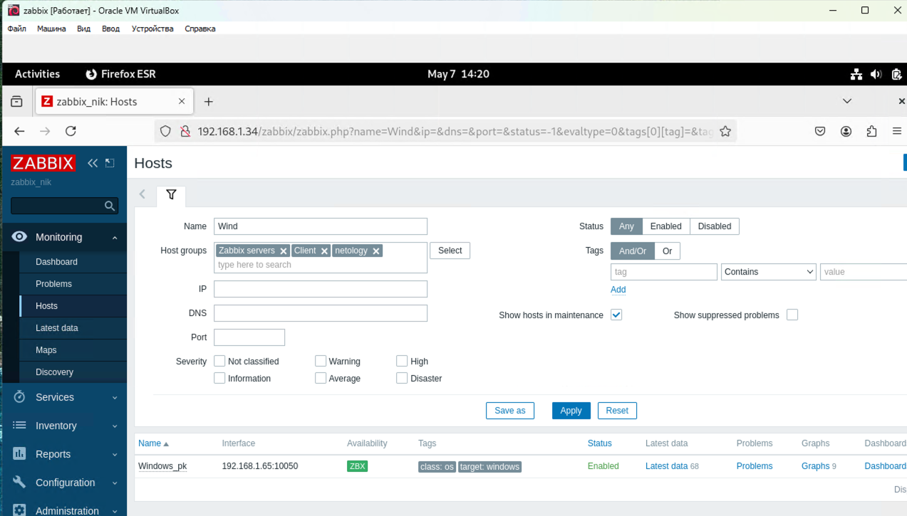
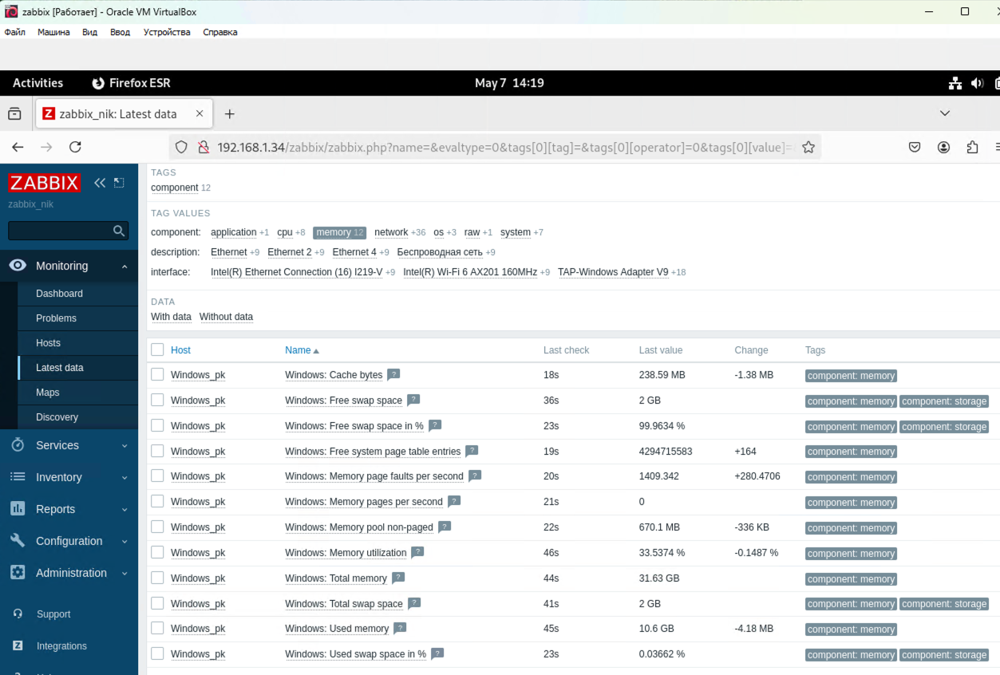

# Домашнее задание к занятию "`Система мониторинга Zabbix`" - `Кошель Николай Павлович`

### Задание 1

1. Страница входа в Zabbix 

2. Команды:
   
    //Установка БД
        apt install postgresql
    //Zabbix
        wget https://repo.zabbix.com/zabbix/6.0/debian/pool/main/z/zabbix-release/zabbix-release_latest_6.0+debian12_all.deb
        dpkg -i zabbix-release_latest_6.0+debian12_all.deb
        apt update 
        apt install zabbix-server-pgsql zabbix-frontend-php php8.2-pgsql zabbix-apache-conf zabbix-sql-scripts zabbix-agent
        sudo -u postgres createuser --pwprompt zabbix //пароль вводится при создании
        sudo -u postgres createdb -O zabbix zabbix
        zcat /usr/share/zabbix-sql-scripts/postgresql/server.sql.gz | sudo -u zabbix psql zabbix

        Edit file /etc/zabbix/zabbix_server.conf
        DBPassword=password //пароль от базы данных

        systemctl restart zabbix-server zabbix-agent apache2
        systemctl enable zabbix-server zabbix-agent apache2

### Задание 2

1. Hosts

2. 

3. 

4. Установка агента
    sudo apt-get install zabbix-agent
    /etc/zabbix/zabbix_agentd.conf // указать IP zabbix Server=
    sudo systemctl restart zabbix-agent
    sudo systemctl status zabbix-agent
    Добавляем hosts     

### Задание 3

1. 

